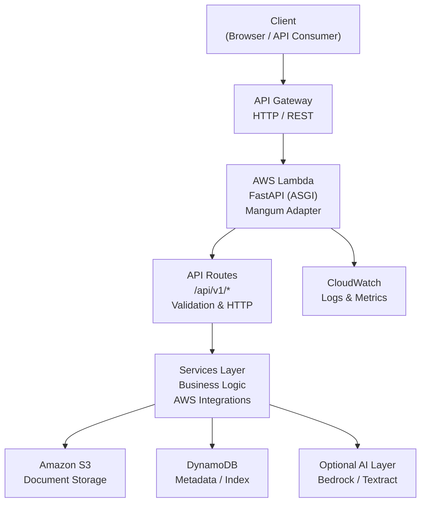

# Cloud Doc Intel Backend

Production-style backend service built with **FastAPI** and **AWS**, designed to demonstrate real-world cloud engineering practices.

This project focuses on:
- clean architecture
- environment separation
- AWS-native integrations
- infrastructure as code

---

## 🚀 Tech Stack

**Backend**
- FastAPI
- Uvicorn
- Pydantic

**AWS**
- Lambda + API Gateway
- S3 (document storage)
- DynamoDB (metadata)
- IAM (least-privilege access)
- CloudWatch (logging)

**Infrastructure**
- Terraform (modular)
- GitHub Actions (CI/CD)

---

## 🧠 Architecture Overview

